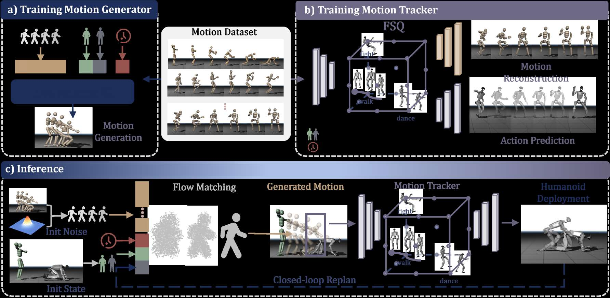
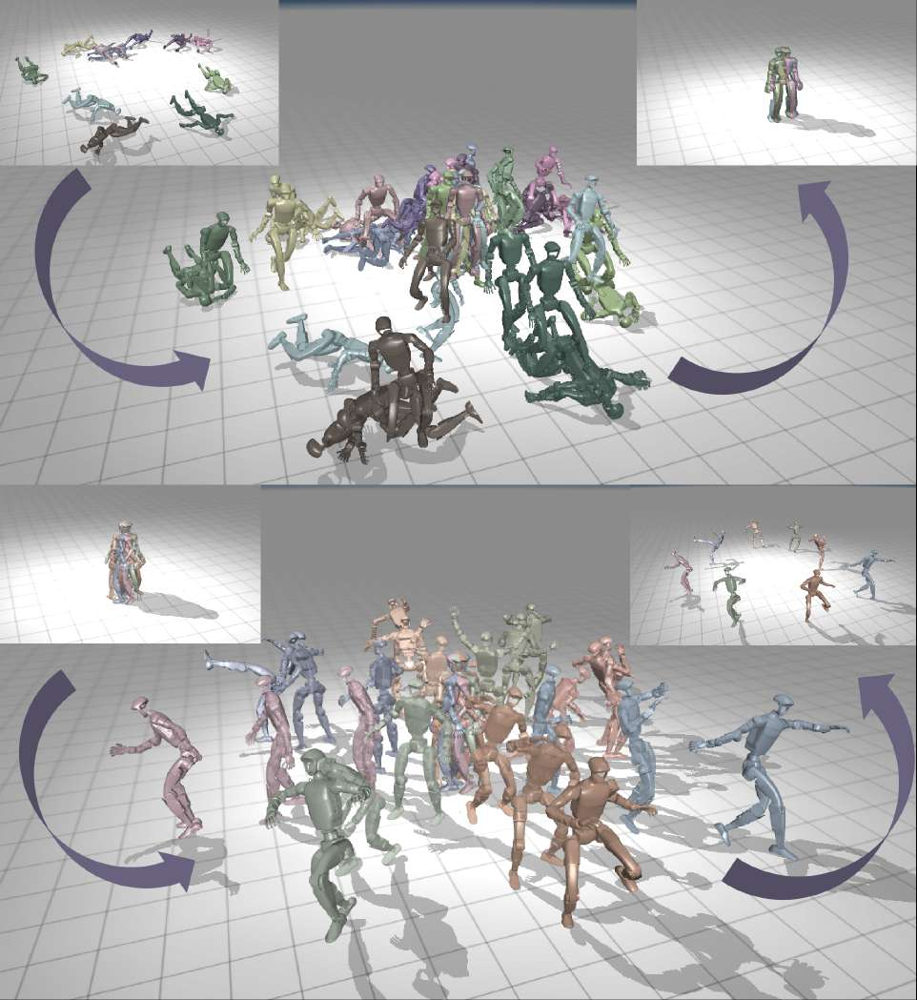
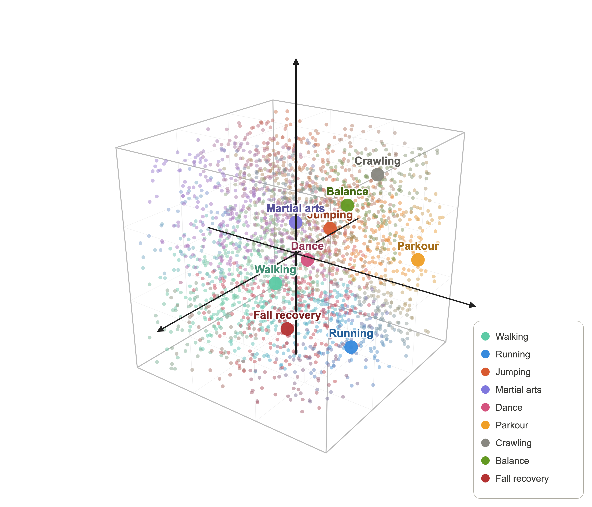
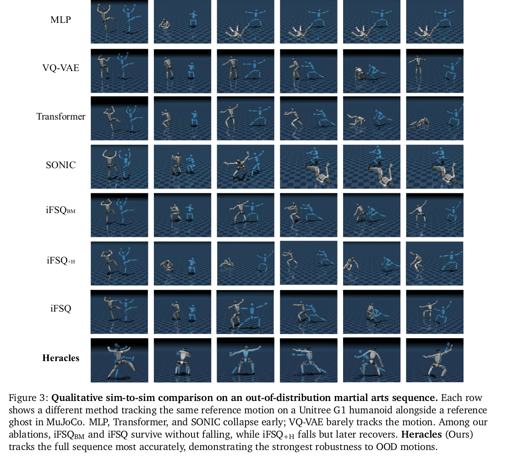
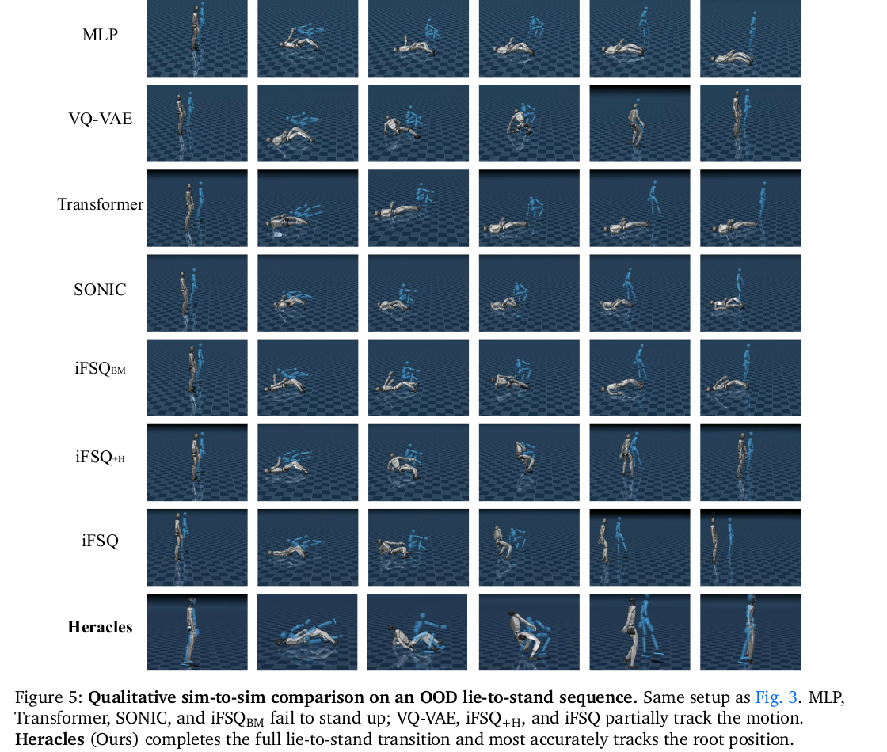
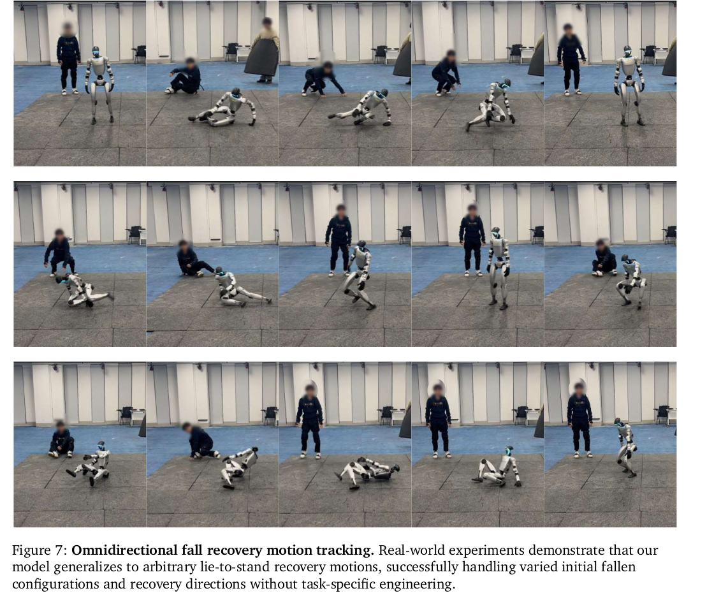

论文: **Heracles: Bridging Precise Tracking and Generative Synthesis for General Humanoid Control**  
作者: X-Humanoid Heracles Project Team, Zelin Tao, Zeran Su 等  
版本: arXiv:2603.27756v2, submitted 2026-03-29, last revised 2026-03-31  
链接: [arXiv](https://arxiv.org/abs/2603.27756), [PDF](https://arxiv.org/pdf/2603.27756), [Project](https://heracles-humanoid-control.github.io/)  

## 一句话结论

Heracles 把一个**状态条件化的生成式轨迹中间层**放在“高层参考动作”和“低层物理跟踪器”之间: 正常跟踪时尽量像 identity map 一样少改参考动作, 严重偏离参考轨迹时改写接下来 0.2 秒的关键帧轨迹, 让机器人先生成可行的恢复动作, 再回到原本任务。

## 论文想解决的问题

当前通用人形控制器大多把问题写成 reference tracking: 给一段 MoCap 或目标轨迹, 低层策略尽量缩小当前状态和参考状态的误差。这在 nominal setting 下很好, 但遇到强推、摔倒、参考轨迹不连续或状态已经远离参考流形时会变得很脆: 控制器会试图“立刻回到原参考姿态”, 产生僵硬、非人形、甚至物理上不可行的动作。

纯生成式动作模型又走到另一个极端: 动作自然、多样, 但往往是开放环的 kinematic trajectory, 不直接考虑真实机器人的接触、扭矩、摩擦、质心和执行器限制, 很难直接落到硬件。

Heracles 的核心主张是: 不要在“严格跟踪”和“生成恢复”之间显式切模式, 而是让一个状态条件化生成模型在闭环里持续改写参考轨迹。状态接近参考时少改, 状态偏离参考时多生成。

## 方法拆解

### 1. 层级闭环架构

系统由两层组成:

- **Generative middleware**: 低频规划层, 输入当前机器人状态 `p_t` 和原始参考动作 `m_t`, 输出短时关键帧轨迹 `tau_t = f_theta(p_t, m_t)`。
- **Physics tracker**: 高频执行层, 输入实时本体状态、被中间层改写后的参考 `m'_t`、离散动作语义 token `z_d`, 输出 29 维关节目标位置, 再由 PD 控制器转成力矩。

推理时是 receding-horizon replanning: 生成器每 `N_exec = 2` 个控制步重规划一次, 也就是 25 Hz; tracker 以 50 Hz 执行, PD 控制以 200 Hz 运行。生成器每次只看固定 0.2 秒窗口, 长时恢复靠多次闭环重规划滚出来。

### 2. 状态条件化 Flow Matching 中间层

虽然论文用 “diffusion middleware” 描述整体思想, 具体实现更接近 **conditional flow matching trajectory generator**。这里的生成模型不直接输出 action 或 torque, 而是在每次重规划时生成一个短时 reference trajectory, 交给 tracker 去追。

#### 2.1 它到底在生成什么

生成器输入:

- 当前真实机器人状态 `p_t`。
- 原始高层参考动作 `m_t`。

生成器输出:

- `K = 8` 个关键帧组成的短时轨迹 `tau_t in R^{K x D}`。
- 规划窗口固定为 `Delta t = 0.2s`。
- 状态维度 `D` 有两个版本: 38D 包含 29D 关节位置、3D root position、6D root orientation; 35D 去掉全局 root position, 更适合只依赖本体感知和 IMU 的真机部署。

最重要的是, 它不是直接预测绝对状态, 而是预测**相对当前状态的残差轨迹**:

$$
\begin{aligned}
\beta_{t,k} &= p_t \\
\tau_t &= \beta_t + r_t
\end{aligned}
$$

直观理解: `beta_t` 是“从现在状态原地不动”的静态轨迹, `r_t` 是未来 0.2 秒应该离开当前状态多少。这样模型不用把大量容量花在复读当前姿态和坐标上, 而是专门学习“从这个身体状态出发, 下一小段自然可行的运动增量是什么”。

这个残差空间是 Heracles 很关键的地方。正常跟踪时 `p_t` 接近 `m_t`, 未来残差基本就是参考动作的自然延续, 生成器看起来像 identity。强扰动时 `p_t` 和 `m_t` 差距变大, 生成器就不再被迫一步回到参考姿态, 而是生成一个更可行的过渡残差。

#### 2.2 Flow matching 的训练目标

训练时, 每条数据样本的目标是 normalized ground-truth residual trajectory, 记为 `x_0`。噪声先验是:

$$
x_1 \sim \mathcal{N}(0, I)
$$

论文采用线性 probability path:

$$
x_t = (1 - t)x_0 + t x_1,\quad t \in [0, 1]
$$

注意这个记号方向: `t = 0` 是真实数据, `t = 1` 是高斯噪声。训练模型 `v_hat(x_t, t, c_t)` 去回归这条直线路径上的速度场:

$$
\begin{aligned}
L_{\mathrm{vel}} &= \mathbb{E}\left\|\hat{v}(x_t, t, c_t) - (x_1 - x_0)\right\|^2 \\
c_t &= [p_t, m_t]
\end{aligned}
$$

因为路径是线性的, 从数据走向噪声的真实速度就是常量 `x_1 - x_0`。训练好后, 如果我们从噪声侧开始并沿着时间反方向积分, 就能从噪声回到数据分布中的残差轨迹。

这和传统 DDPM 的味道不完全一样:

- DDPM 通常学习去噪、score 或 noise prediction, 有一个离散或连续的加噪日程。
- Heracles 这里学的是 ODE velocity field, 目标非常直接: 在任意中间点告诉我“这条样本路径的速度应该是多少”。
- 推理时不需要几十上百步去噪, 论文里只用 5 个 Euler steps, 这对闭环控制很重要。

所以这里说 diffusion 更像是广义上的生成式噪声到数据过程; 从实现看, flow matching 才是准确的技术名字。

#### 2.3 条件变量为什么是 `[p_t, m_t]`

`p_t` 是物理现实, `m_t` 是任务意图。Heracles 把二者同时塞进条件向量:

$$
c_t = [p_t, m_t]
$$

这让模型可以读出一个隐含量: 当前身体状态和目标参考之间的 gap。

- gap 小: 说明 tracker 还在 reference manifold 附近, 生成器应当少改参考。
- gap 大: 说明严格追踪已经危险, 生成器应当优先生成恢复或过渡轨迹。

这就是论文所谓“无需显式模式切换”的来源。没有 if-fall-then-recover 的状态机, 也没有人工阈值。模式变化被压进条件分布里, 由 `[p_t, m_t]` 的相对关系触发。

还有一个细节: 在训练目标里, `m_t` 不直接出现在残差监督的右侧, 而是只作为 conditioning。也就是说, 模型不是被训练成简单输出 `m_t - p_t`, 而是学一个条件分布:

$$
P(\text{residual trajectory}\mid \text{current physical state}, \text{target reference})
$$

这点很重要。如果目标只是 `m_t - p_t`, 它又会退化成 rigid tracking。Heracles 想学的是“给定现在这个身体状态和目标意图, 一个自然可行的下一段动作残差是什么”。

训练数据构造也在强化这个思想。论文从动作序列里采样不同长度的 segment, conditioning 里的 `m_t` 来自 segment endpoint, 但监督 keyframes 只覆盖固定的前 `H` 帧, 也就是固定 `Delta t` 的局部窗口。这样一来, target command 可以离当前状态很远, 但模型永远只需要输出有界的短时残差。远目标负责提供方向和意图, 监督目标负责保持局部可执行。

#### 2.4 推理时如何从噪声生成轨迹

标准 flow matching 推理可以从纯噪声 `x_1` 开始, 从 `t=1` 积分到 `t=0`。Heracles 为了实时控制做了一个更工程化的改法: **directional warm start**。

先构造一条从当前状态指向目标参考的线性残差:

$$
r_{\mathrm{init},k} = \frac{k}{K - 1}(m_t - p_t),\quad k = 0,\ldots,K-1
$$

然后不是从纯噪声开始, 而是从部分加噪的方向先验开始:

$$
\begin{aligned}
x_{t_{\mathrm{start}}} &= (1 - t_{\mathrm{start}})\operatorname{normalize}(r_{\mathrm{init}}) + t_{\mathrm{start}}\epsilon \\
t_{\mathrm{start}} &= 0.9 \\
\epsilon &\sim \mathcal{N}(0, I)
\end{aligned}
$$

直观上, `r_init` 给了“朝哪里走”的粗方向, 噪声保留了生成模型的自由度。模型不必把 5 个 Euler steps 浪费在猜大方向上, 可以把计算预算用来把线性、僵硬的初始轨迹修成自然的短时动作。

反向 Euler 积分可以理解成:

$$
x \leftarrow x + (t_{\mathrm{next}} - t_i)\hat{v}(x, t_i, [p_t, m_t]),\quad t_{\mathrm{next}} < t_i
$$

因为 `t_next - t_i` 是负数, 而 `v_hat` 学的是数据到噪声的方向, 所以这个更新会把样本从噪声侧推回数据侧。

#### 2.5 inpainting anchor 保证起点连续

生成轨迹不能第一帧就和真实机器人状态断开。论文用 inpainting constraint pin 住第一个 residual token:

$$
x_t[0] = (1 - t_{\mathrm{next}})r_0 + t_{\mathrm{next}}\epsilon
$$

其中 `r_0` 是零残差 anchor, 对应“第一个关键帧就是当前状态”。这类似图像 diffusion 里的 inpainting: 某些位置不是自由生成, 而是被条件约束住。放在控制里, 这个约束的意义更强, 因为轨迹起点如果不连续, 低层 tracker 会立刻收到一个不真实的跳变 reference。

#### 2.6 生成后如何接到 tracker

Flow matching 输出的是 8 个稀疏 keyframes。部署时还要把它变成 tracker 每个控制步可读的 dense reference:

- joint positions 用 cubic spline interpolation。
- root orientations 用 spherical linear interpolation, 即 SLERP。
- densified trajectory 写入 reference buffer。
- tracker 在接下来 `N_exec = 2` 个控制步里执行它。
- 0.04 秒后重新观测真实状态, 再跑下一次生成。

因此 Heracles 的长时恢复不是一次生成完整起身动作, 而是很多个 0.2 秒片段不断闭环拼接出来。这个设计很像 MPC 的味道: 每次只承诺短窗口, 一边执行一边根据真实物理状态修正计划。

#### 2.7 为什么这种生成层适合做人形控制中间件

我觉得这部分是论文最独特的技术品味:

1. **生成模型学 trajectory residual, 不学 torque。**  
   它避开了直接接管低层控制的高风险, 让成熟的 physics tracker 继续处理接触、PD、动作平滑和 sim-to-real。

2. **flow matching 只在低维短时轨迹空间里生成。**  
   `K x D` 的短窗口比整段动作、全身 torque 序列或长时 latent plan 都更容易实时采样。

3. **状态条件化让“跟踪”和“恢复”共用一个模型。**  
   近参考时生成结果接近原参考; 远参考时生成结果偏向恢复。这个切换不是显式规则, 而是条件生成分布的形状变化。

4. **warm start 把生成模型变成实时 refine 器。**  
   纯噪声采样适合离线生成, 但控制闭环需要低延迟。方向先验让模型从“粗糙但方向对”的轨迹开始修, 5 步就够用。

5. **inpainting anchor 把生成轨迹钉在物理现实上。**  
   这点比普通 motion generation 更重要, 因为机器人必须从当前实际姿态连续出发, 不能从一个想象中的干净姿态出发。

也可以把 Heracles 的 flow matching 层理解成一个**实时参考轨迹修复器**: 高层给的是“想做什么”, 当前状态告诉它“身体现在实际在哪里”, 生成模型负责把两者之间可能导致摔倒的硬跳变修成一段短时可追踪的身体动作。

### 3. 通用物理跟踪器

tracker 的 observation 是 `{p_t, m_t, z_d}`:

- `p_t`: gravity projection, root angular velocity, joint positions/velocities, previous action。
- `m_t`: 参考 root linear/angular velocity, root orientation error, target joint positions。
- `z_d`: iFSQ 离散 motion token, 代表高层动作语义。

策略结构是 encoder-quantizer-decoder:

- motion encoder 看未来 10 帧参考动作, 得到连续 latent `z_c`。
- iFSQ 把 latent 量化为离散 token `z_d`。
- reconstruction decoder 用来重建 10 帧动作, action decoder 把 `z_d` 和 10 步 proprioception history 融合后输出关节目标。

iFSQ 的动机是比 VQ-VAE 更稳定地利用 codebook。论文的 Fig.6 显示, 训练后 token 在 PCA 空间里会按 walking、running、martial arts、dance、fall recovery 等动作语义自组织成簇。

### 4. 训练技巧

生成器的几个训练细节非常关键:

- **receding-horizon dataset construction**: 从动作库切片, 但监督目标只覆盖固定 horizon `H`, 避免让模型一次预测过长恢复。
- **noisy-state augmentation**: 只污染起始 proprioceptive state, 保持 reference command 干净, 模拟部署时“状态估计和跟踪误差有噪声, 参考动作仍干净”的不对称情况。
- **kinematics-aware loss weighting**: 用近似 Jacobian magnitude 给不同关节维度加权, 让相同 joint error 在不同姿态下的 body-space 影响被区分开。
- **adaptive motion sampling**: tracker 训练时根据 temporal bin 的困难度调整采样, 避免大量简单 locomotion 淹没高动态片段。

## 实验设置

平台是 Unitree G1, 约 1.32 m, 35 kg, 29 actuated DoF。训练在 IsaacLab 中进行, 单张 A100 80 GB 上开 16,384 个并行环境, 物理仿真 200 Hz, policy 50 Hz。评估在 MuJoCo 上做 sim-to-sim, 测试集有 101 条未见过的 motion sequences, 覆盖 locomotion、dance、martial arts、daily activities、fall-and-recovery、acrobatic jumps 和离散化参考信号。

训练动作库来自 LAFAN1、100STYLE、SnapMoGen、AMASS 和内部 MoCap。这里要注意, 内部数据的比例、覆盖范围和清洗细节没有完整展开, 复现时会是一个现实障碍。

## 实验给方法提供了什么证据

这里不重点讨论 Heracles 比其他 baseline 强多少, 只看实验如何支持它的核心设计。

### 1. 普通跟踪: 生成层不是简单提升所有指标

全测试集里, Heracles 的 completion rate 最高, 但有些逐帧 tracking error 并不是最优。这个现象反而说明它不是一个只追求“逐关节贴参考”的模块。生成中间层会在必要时牺牲一点局部精确性, 换取更稳定的全身过渡和更高的动作完成率。

这和方法设计是一致的: flow matching 层改写的是短时 reference, 它在状态偏离时优先生成可行过渡, 而不是强制 tracker 立刻追上原始 reference。

### 2. Fall-and-recovery: 这是生成中间层真正发挥作用的场景

fall-and-recovery 子集是最能说明问题的实验。这里机器人状态经常离 reference 很远, 纯 tracker 会把“回到参考姿态”理解成一个瞬时纠错问题, 于是容易出现僵硬、不可行的动作。Heracles 则把问题改成短时轨迹生成: 先给出一段能从当前姿态连续出发的恢复 reference, 再交给 tracker 追。

因此我们不必太纠结每个 baseline 的数值差别, 更重要的是看 Fig.5 的行为差异: Heracles 完整完成 lie-to-stand, 说明它的生成层确实在极端状态转换里扮演了 planner/refiner 的角色。

### 3. Ablation: 哪些 flow matching 细节真的重要

Table 6 的意义在于说明生成器不是“随便加一个 diffusion 模块”就行。三个技术细节都影响很大:

- full Heracles: 90.6% CR
- w/o directional warm start: 87.2% CR
- w/o noisy-state augmentation: 78.6% CR
- w/o kinematics-aware weighting: 82.1% CR

我的理解:

- 去掉 warm start 后, 模型需要从纯噪声里同时猜方向和自然性, 5 步 Euler 的预算就不太够。
- 去掉 noisy-state augmentation 后, 条件变量 `p_t` 的训练分布过于干净, 部署时遇到 tracker drift 和传感噪声就会失配。
- 去掉 kinematics-aware weighting 后, 模型不知道同样的 joint error 在不同姿态下会造成不同 body-space 后果, 对极端姿态转换尤其伤。

### 4. 真机展示

论文展示了 Unitree G1 上的 walking、running、kick、360 degree kick、HOI 和多方向 lie-to-stand。Fig.7 尤其强调不同摔倒姿态和恢复方向, 不是单一固定方向的起身脚本。

## 这篇论文真正的贡献

我觉得贡献不只是“用了 diffusion/flow matching”。更准确地说, 它提出了一个很清楚的控制接口:

> 生成模型不直接控制关节, 而是实时改写 tracker 要追的 reference。

这带来两个好处:

- 保留现有 physics tracker 的高频稳定性和 sim-to-real pipeline。
- 让生成模型在较低频率上处理更抽象的“接下来该怎么恢复”的问题。

这个接口漂亮的地方在于, 它不要求生成模型每一步都输出 torque, 也不要求 tracker 理解长时恢复策略。两边各做自己擅长的事。

## 等作者放出更多信息后再补

这些问题现在问得出来, 但可能要等代码、模型或更多实验细节出来才能判断:

- near-nominal tracking 时中间层到底改写了多少 reference, identity-like behavior 是否有额外约束。
- fall-and-recovery 数据在训练集里的占比、来源和多样性。
- 25 Hz 生成层在真机上的实际推理设备、平均延迟和 worst-case latency。
- 35D 无全局位置版本与 38D 版本在复杂场景中的差异。
- 如果连续受到外力、地面不平、持物或关节性能下降, 这个短时 flow matching refiner 的边界在哪里。

## 术语对照

- **reference tracking**: 跟踪给定参考动作, 通常最小化当前状态和参考状态误差。
- **generative middleware**: 位于参考动作和低层控制器之间的生成式轨迹改写模块。
- **flow matching**: 学习从噪声分布到数据分布的连续向量场, 推理时通过 ODE 积分生成样本。
- **receding horizon**: 每次只规划短时窗口, 执行一点后重新观测并重规划。
- **iFSQ**: improved Finite Scalar Quantization, 用固定标量级别把连续 latent 离散化。
- **anthropomorphic recovery**: 类人恢复动作, 比如迈步扩展支撑面、手臂反摆、躯干逐步回正。

## 当前阅读结论

这篇论文最值得记住的是它把 flow matching 放在了一个非常务实的位置: **不抢低层控制权, 只改写即将被追踪的短时参考轨迹**。因此它既能利用生成模型的动作先验, 又不丢掉已经成熟的物理跟踪器和 PD 执行链路。

下一轮可以继续把这一节画成更直观的算法图: training tuple 如何构造, `x_0 -> x_t -> x_1` 的 flow matching 路径是什么, 以及推理时 warm-started reverse Euler 怎样一步步把线性残差修成轨迹。
