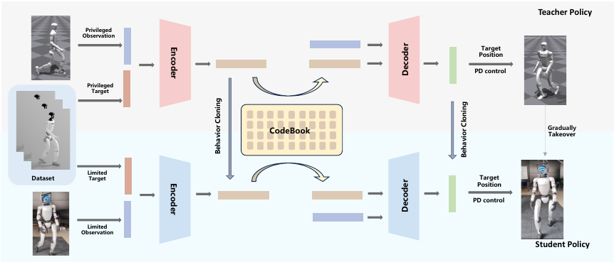
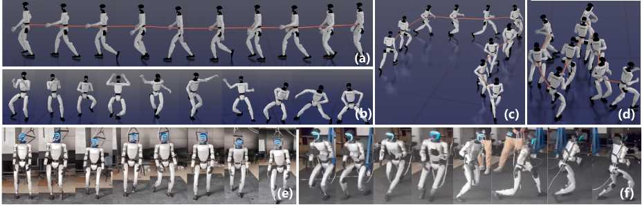
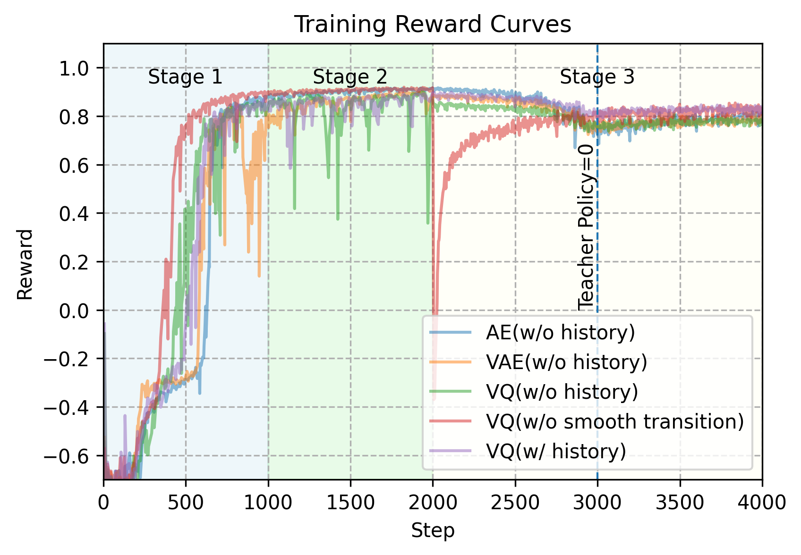
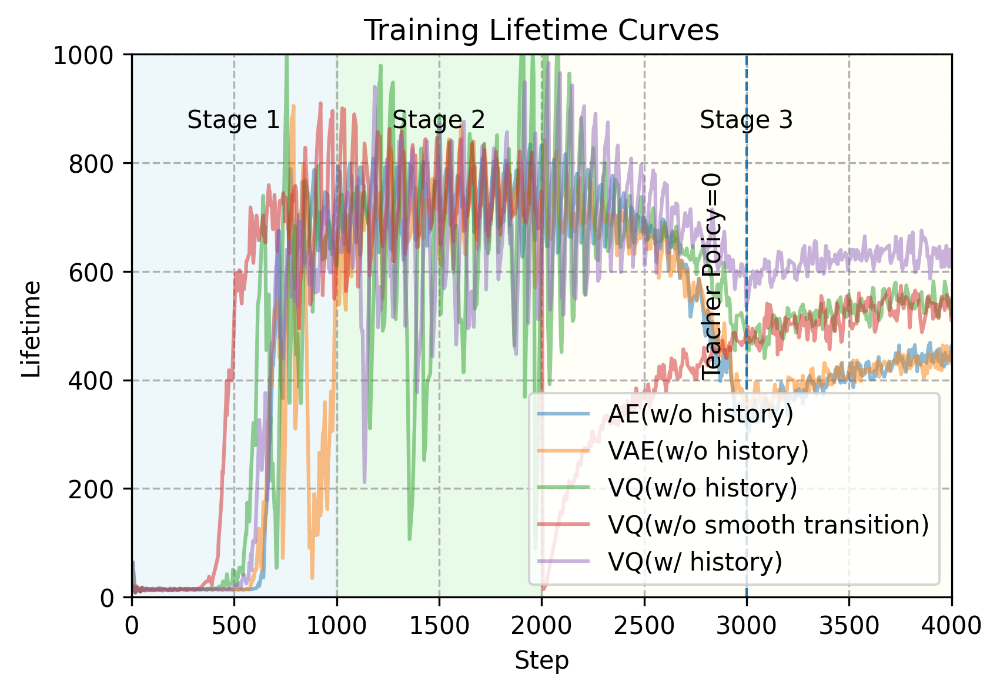
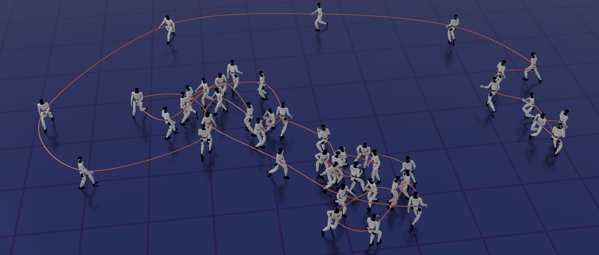
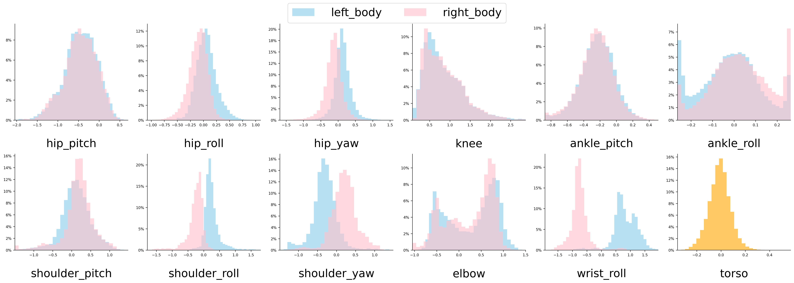

论文: **MuGen: Multi-Skill Generative Locomotion Controller for Humanoid Robots**  
作者: Yusen Feng, Xiang Wang, Heyuan Yao, Zixi Kang, Xinyu Huo, Boyang Yu, Pengyun Qiu, Ruijie Zhao, Baoquan Chen, Libin Liu  
机构: Peking University  
版本: arXiv:2605.24592v1, submitted 2026-05-23  
链接: [arXiv](https://arxiv.org/abs/2605.24592), [PDF](https://arxiv.org/pdf/2605.24592)  

## 一句话结论

MuGen 的核心是把人类动作数据压进一个**离散的、动力学可执行的 VQ 技能空间**里: teacher policy 在仿真中用 privileged state 和可微 world model 学会追踪参考动作, 同时建立 codebook; student policy 只用真机可获得的局部观测, 通过共享 codebook 和 DAgger-style 渐进接管把 teacher 的技能蒸馏下来, 最后既能追踪参考动作, 也能通过采样 codebook 做 reference-free 的动作生成。



我的第一印象: MuGen 不是把一个外部 motion generator 接到 tracking controller 前面, 而是把“生成能力”直接做进控制器的 latent action space。这里的 generation 更像**技能离散化 + 技能复用**: policy 每步先选一个 codebook 中的运动技能 embedding, 再由 decoder 生成关节目标。

## 论文想解决的问题

人形机器人模仿人类动作通常有两类瓶颈。

第一, 直接 reference tracking 很容易变成“给什么追什么”的黑盒策略。它能在训练分布内拟合动作, 但未必学到可复用的动作结构, 也不一定能从大规模异质动作里抽出 walking、running、crouching、turning 这类稳定技能模式。

第二, 把 motion generation 和 robot control 分开也有风险。外部生成器产生的 kinematic trajectory 看起来像人, 但不一定在机器人动力学、接触、执行器限制下可追踪。tracking policy 追不上时, 生成和控制之间的断层会直接变成摔倒或大误差。

MuGen 的判断是: 技能空间不能只从 kinematic motion 里学, 要在物理仿真闭环里学。也就是说, codebook 里的 latent skill 不只是“像人类动作”的压缩表示, 还要和 robot action、world model、PD tracking 共同训练, 尽量让每个离散技能都落在机器人可执行的动作流形上。



## 方法主线

MuGen 由四个关键部件组成:

- **World model**: 学一个可微动力学模型 $W$, 用于预测 teacher action 之后的下一状态, 让 teacher policy 可以通过反向传播优化 tracking loss。
- **Teacher policy**: 使用 privileged global state 和 reference motion, 通过 VQ bottleneck 学一个离散技能 codebook。
- **Student policy**: 使用 limited/local observation, 共享 teacher 学到的 codebook, 同时做 action-level cloning 和 latent-space alignment。
- **Prior encoder**: 在 reference-free 生成模式下, 只根据本体状态预测 codebook index 分布, 让 student decoder 直接生成动作。

可以把整体训练理解成:

```text
1. Teacher 在全信息状态下追踪参考动作
   同时训练 world model、encoder、VQ codebook、decoder

2. Student 使用局部可部署观测模仿 teacher
   codebook 共享, 通过 latent alignment 保持技能语义一致

3. Distillation 阶段逐步让 student 接管仿真 rollout
   teacher 概率线性降到 0, 避免突然切换造成分布崩塌

4. 可选地训练 prior encoder
   输入只有 proprioception, 输出 codebook index 分布
```

## 1. World Model: 把追踪训练变成可微优化

论文把任务写成 POMDP:

$$
\mathcal{M}=\langle S,O,G,A,P,R\rangle
$$

普通 model-free RL 要在真实环境转移 $P(s'|s,a)$ 里采样 rollout, 再用高方差的策略梯度估计优化 reward。MuGen 则学习一个 world model:

$$
W(s'|s,a)
$$

它输入当前状态 $s_t$ 和 teacher action $a_t$, 预测下一步状态变化, 再积分得到 $s^W_{t+1}$。world model 的监督来自仿真真实转移:

$$
L_W=\sum_{t=0}^{T-1}\gamma^t\left\|W_W(s^{sim}_{t+1}-s^W_{t+1})\right\|_1
$$

这里 $W_W$ 是不同状态分量的权重。附录里给出的权重是 position、rotation、velocity、angular velocity 对应 $[2,1,10,5]$。

这个 world model 的作用不是部署, 而是给 teacher policy 提供可微训练路径。Teacher 输出 action 后, 不用等真实 simulator 的不可微 step 来算梯度, 而是通过 $W$ 预测后续状态, 直接对 tracking loss 反传。

这一步的味道更像**可微 imitation / model-based tracking**:

- 目标仍然是让预测状态贴近参考动作。
- world model 只要梯度方向足够有用, teacher 就能被优化。
- 但 world model 的精度会成为 teacher 的上限, 这也是作者在 limitations 里承认的问题。

## 2. VQ 技能空间: 让控制器学离散运动基元

Teacher policy 包含 encoder、VQ bottleneck 和 decoder:

$$
\begin{aligned}
z_t &= E(s_t,m_t) \\
\hat{z}_t &= B(z_t) \\
a_t &\sim D(\cdot \mid \hat{z}_t,s_t)
\end{aligned}
$$

其中 $m_t$ 是参考动作, $B$ 是可训练 codebook。Encoder 先把状态和参考动作映射成连续 latent, 然后 VQ bottleneck 把它量化到最近的 codebook entry。Decoder 再根据离散技能 embedding 和当前状态输出关节目标分布, 后面由 PD controller 执行。

Teacher 的训练目标大致是:

$$
\begin{aligned}
L_T
=\sum_{t=0}^{T-1}\gamma^t(&
\underbrace{\|W_T(s^W_{t+1}-m_{t+1})\|_1}_{L_{rec}} \\
&+\underbrace{\beta_1\|\mathrm{sg}(E(s_t,m_t))-\hat{z}_t\|^2}_{L_{VQ}} \\
&+\underbrace{\beta_2\|a_t\|^2+\beta_3\|a_t-a_{t-1}\|^2}_{L_{reg}})
\end{aligned}
$$

几个细节值得记:

1. **Codebook 是在物理追踪训练里形成的。**  
   它不是先用纯 MoCap 训练一个 VQ-VAE, 再丢给 controller。Teacher 的 codebook 与 action decoder、world model tracking loss 一起优化, 因而 latent skill 更贴近机器人可执行动作。

2. **VQ 不是装饰, 它是论文主张之一。**  
   作者认为动作数据的关节分布明显非高斯、多峰, 连续 VAE 的标准高斯先验不合适。这个论证从统计上不算绝对, 但实验上 VQ policy 在 unseen tracking 上确实更稳。

3. **Codebook 训练后会冻结。**  
   Student 蒸馏时不再更新 codebook, 这样 student 学的是 teacher 已经整理好的技能空间, 而不是一边模仿一边把技能语义拖走。

我觉得这里最关键的不是“离散”本身, 而是离散技能给 student 提供了一个稳定的中间监督对象: student 不只模仿 action, 还要把自己的 encoder 输出对齐到 teacher 的 skill embedding。

## 3. Student Distillation: 共享 codebook, 渐进接管

Teacher 可以看 privileged global state, 包括全身 link 的位置、姿态、速度、角速度等信息; student 只能看真机更现实的 local observation:

$$
s_{\mathrm{proprioception}}=\{g,w\}\cup\{q_j,dq_j\}_{j\in J}
$$

也就是 projected gravity、body angular velocity、关节位置和关节速度。Student 的目标是用这些有限观测复现 teacher 的决策。

Student loss 同时包含 action cloning 和 latent alignment:

$$
L_S=\sum_{t=0}^{T-1}\gamma^t\left(
\underbrace{\|a_t^S-a_t^T\|_2}_{L_{BC}}
+\beta_4
\underbrace{\mathbb{E}_{s_t\sim\rho_{\pi^S}}
\|E^S(s_t,g_t)-E^T(s_t^{full},m_t)\|_2}_{L_{align}}
\right)
$$

这里的 $L_{align}$ 很重要: student encoder 要输出能落入 teacher codebook 语义空间的 embedding。这样 privileged information 不直接部署, 但它学出的 skill representation 被迁移了。

训练 schedule 分三段:

1. **Pretraining**: 只训练 teacher 和 world model, teacher rollout, 建立 codebook。
2. **Warming up**: 开始训练 student, 但 rollout 仍由 teacher 控制, 给 student 稳定示范。
3. **Distillation**: 每个 rollout step 随机选择 teacher 或 student 控制, teacher 概率线性退火到 0。

作者强调这个策略不同于标准 DAgger: 不是整条 trajectory 由一个 policy 控制, 而是在单条轨迹中混合 teacher/student。好处是 student 某一步犯错时, teacher 还有机会在后续 step 把机器人拉回稳定区域, 减少 distillation 初期的崩溃。



Fig.4 的训练曲线也支持这一点: 没有 smooth transition 的版本在阶段切换时明显不稳, 最终 reward 和 lifetime 都更差。



## 4. Reference-free Generation: 用 prior encoder 采样技能

MuGen 的 tracking 模式仍然需要参考动作 $m_t$。为了展示生成能力, 作者额外训练了一个 prior encoder:

$$
\hat{E}=\hat{E}(z\mid s)
$$

它只接收 proprioception, 输出离散 codebook index 的概率分布。训练时, teacher policy 追踪随机参考动作, 产生每一步实际使用的 codebook index; prior encoder 用这些 index 做交叉熵监督。

推理时组合如下:

```text
proprioception s
    -> prior encoder E_hat predicts code index distribution
    -> sample / choose VQ code z_hat from frozen codebook B
    -> frozen student decoder D outputs joint target
    -> PD controller executes
```

这样 student 不再需要 reference trajectory, 也能从 learned skill space 中生成 walking、running、crouching、turning 等动作之间的转换。



这部分是论文名字里 “Generative Locomotion Controller” 的关键展示。不过我会稍微保留一点判断: 论文对 reference-free generation 主要给了 qualitative 轨迹图, 没有像 tracking task 那样提供系统的量化指标。因此它更像证明 codebook 有可采样性, 而不是完整证明已经具备高层可控的 motion generation。

## 5. 实验结论

训练和评估在 Isaac Gym 中完成。数据来自 Unitree 提供的、retarget 到 G1 机器人运动学模型的 LaFAN1 locomotion subset, 总时长约 1 小时。训练中使用 domain randomization, 包括摩擦、躯干负载、PD gain、关节观测噪声、角速度观测噪声、gravity projection 噪声等。

真机平台是 Unitree G1:

- 质量 35 kg, 身高 1.32 m。
- 23 个 actuated DoF: 双腿各 6, 双臂各 5, 腰部 1。
- Policy 以 30 Hz 输出关节目标位置。
- 低层 PD controller 以 500 Hz 执行。
- 真机只部署了安全筛选后的动作, 图中包括 straight walk 和 crouching walk。

### Tracking ablation

论文在一个约 200 秒 walking subset 上训练, 在 seen 和 unseen walking motions 上测试, 每个策略跑 1024 个 domain-randomized environments。指标包括:

- **SR**: survival rate, 没摔倒完成 rollout 的比例。
- **MJRE**: mean joint rotation error, 成功 rollout 中的平均关节旋转误差, 单位 rad。
- **MVE**: mean linear velocity error, root velocity 与参考的平均误差。

| Model | SR seen ↑ | MJRE seen ↓ | MVE seen ↓ | SR unseen ↑ | MJRE unseen ↓ | MVE unseen ↓ |
|---|---:|---:|---:|---:|---:|---:|
| baseline w/o history | 0.9082 | 0.0759 | 0.3581 | 0.6070 | 0.0996 | 0.4832 |
| VAE-based w/o history | 0.6490 | 0.0842 | 0.3519 | 0.5151 | 0.1094 | 0.4359 |
| VQ-based w/o history | 0.8072 | 0.0977 | 0.4303 | 0.7279 | 0.1108 | 0.4686 |
| MuGen | 0.8820 | 0.0791 | 0.3404 | 0.9535 | 0.0927 | 0.3652 |

读这个表时要注意两点。

第一, vanilla baseline 在 seen motion 上并不弱, 甚至 seen SR 和 MJRE 比 MuGen 略好。但 unseen SR 从 0.9082 掉到 0.6070, 说明它更像记住训练集上的 tracking map。

第二, MuGen 的优势集中在 unseen robustness: unseen SR 达到 0.9535, 同时 MJRE 和 MVE 也最低。这支持作者的主张: 离散技能空间和 student history 能提高泛化稳定性。

### History ablation

| #HT | #HS | SR seen ↑ | MJRE seen ↓ | MVE seen ↓ | SR unseen ↑ | MJRE unseen ↓ | MVE unseen ↓ |
|---:|---:|---:|---:|---:|---:|---:|---:|
| 0 | 0 | 0.8072 | 0.0977 | 0.4303 | 0.7279 | 0.1108 | 0.4686 |
| 0 | 5 | 0.8820 | 0.0791 | 0.3404 | 0.9535 | 0.0927 | 0.3652 |
| 2 | 5 | 0.8666 | 0.0907 | 0.3674 | 0.6810 | 0.1101 | 0.4230 |
| 5 | 5 | 0.2006 | 0.0925 | 0.4455 | 0.2615 | 0.1170 | 0.4888 |
| 2 | 10 | 0.6901 | 0.0824 | 0.3605 | 0.4824 | 0.1066 | 0.4156 |

`#HT` 是 teacher history frame 数, `#HS` 是 student history frame 数。最好的组合是 teacher 不看历史、student 看 5 帧历史。

这个结果挺有意思: student 需要历史来恢复速度、趋势和动作连续性; 但给 teacher 过多历史反而会让表征变难, 可能引入噪声或超出当前网络容量。作者的解释是 moderate history helpful, excessive history harmful。

## 6. 数据分布与 VQ 选择

附录里作者展示了 LaFAN1 locomotion subset 的关节角分布。很多关键关节, 特别是 ankle、elbow、knee, 呈现明显非高斯、多峰分布。



作者用这点解释为什么不用 VAE 的标准高斯 latent prior, 而选择 VQ codebook。这里我觉得可以稍微更谨慎地理解: 关节 marginal 非高斯并不严格推出连续 latent VAE 一定不适合, 因为 decoder 可以把高斯 latent 映射到非高斯数据分布。但在这个任务里, 实验确实显示 VQ 比 VAE 更稳定, 尤其在保持离散技能语义和避免 latent space 模糊方面更适合。

## 7. 局限与值得继续追的问题

论文自己列了三个局限:

1. **不擅长稳定站立。**  
   Codebook 主要由 motion-rich sequences 训练, 静态或准静态姿态 underrepresented。生成策略会在相近但不同的 embedding 之间摆动, 形成 shuffling 或 pacing。

2. **World model 太简单。**  
   目前只是 MLP, 没显式建模接触和环境交互。只要梯度方向有用, 它能帮助 teacher 优化; 但精度不足会限制精确 tracking。

3. **Sim-to-real 主要靠 domain randomization。**  
   真机部署仍然挑战很大。作者认为未来可以用 real-world rollout fine-tune world model, 再重新 distill student。

我额外想追的几个点:

- **VQ codebook 到底学到了多清楚的技能语义?**  
  论文展示了生成轨迹, 但没有给 codebook usage、cluster 可视化或 skill transition 统计。后续如果有代码或补充材料, 这部分很值得看。

- **Table I 的比较是否完全公平?**  
  MuGen 使用了 student history, 而 baseline 标注为 w/o history。Table II 证明 history 本身很重要, 所以 MuGen 的提升来自 VQ、history、distillation schedule 的组合, 不是单独来自 VQ。

- **Reference-free generation 的可控性还不强。**  
  目前 prior encoder 只从状态采样技能, 更像自发运动生成。若要做 prompt-driven 或 command-conditioned locomotion, 还需要一个高层条件接口把语言、速度、方向、地形目标映射到 skill sequence。

- **World model bias 会不会让 teacher 学到仿真中不可持续的捷径?**  
  论文通过真实 simulator rollout 收集 buffer 并交替更新 $W$, 但 teacher 梯度仍来自 learned model。这个 model bias 对高动态动作、接触丰富动作的影响值得二刷。

## 和 Heracles / PARC 的位置关系

把最近几篇放在一起看, MuGen 的位置比较清楚:

- **PARC** 把 diffusion generator 放在离线数据扩增闭环里, 由 physics tracker 过滤和纠错。
- **Heracles** 把 flow-matching middleware 放在实时 reference repair 位置, 每 0.2 秒生成短时可追踪轨迹。
- **MuGen** 则不单独生成 reference trajectory, 而是在 controller 内部学习一个 VQ skill/action space, 让 tracking 和 generation 都通过同一个离散技能 codebook 发生。

所以 MuGen 最值得看的不是“生成模型有多强”, 而是它如何把生成式表示变成可部署控制器的一部分: teacher 用全信息和 world model 把技能空间塑形, student 再用有限观测继承这个技能空间。

## 当前理解小结

MuGen 的技术品味在于把复杂问题拆成两个相对稳的映射:

```text
human motion + privileged simulated state
    -> dynamics-aware discrete skill codebook

deployable proprioception
    -> same skill codebook
    -> joint target action
```

它没有试图让一个大生成模型直接吐 torque, 也没有完全相信 kinematic motion generator。它把“像人一样动”的知识压进离散 latent, 再用 teacher-student distillation 把这个 latent 接到真机可用的观测上。这个设计保守但很工程化, 也是它能在 G1 上做出初步真机效果的原因。
