论文: **PARC: Physics-based Augmentation with Reinforcement Learning for Character Controllers**  
作者: Michael Xu, Yi Shi, KangKang Yin, Xue Bin Peng  
会议: SIGGRAPH Conference Papers 2025  
链接: [Project](https://xbpeng.github.io/projects/PARC/), [PDF](https://xbpeng.github.io/projects/PARC/PARC_2025.pdf), [Code](https://github.com/mshoe/PARC), [DOI](https://doi.org/10.1145/3721238.3730616)  

## 一句话结论

PARC 的核心不是直接训练一个“无所不能”的 parkour 控制器, 而是搭了一个**自我扩增的数据循环**: 先用小规模 parkour MoCap 训练地形条件 motion generator, 让 generator 在新地形上合成 kinematic motions, 再用强化学习训练的 physics-based tracker 去追踪并“物理纠错”, 最后把成功追踪出来的 simulated motions 回灌数据集, 继续训练 generator 和 tracker。

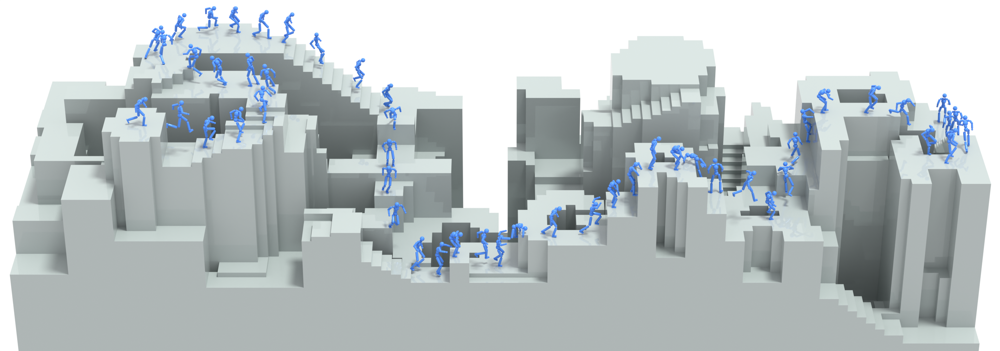

我的第一印象: PARC 的关键技术品味在于把生成模型放在**离线/半离线数据扩增环**里, 而不是强行让扩散模型实时控制角色。这样 diffusion 负责扩大动作分布, physics tracker 负责把明显违反物理的 kinematic artifacts 压下去。

本轮阅读重点: 这篇论文最值得细看的不是 tracker 本身, 而是作者如何把一个小数据上的 terrain-conditioned motion generator 用成可靠的数据扩增器。下面会把 generator 的任务定义、训练样本构造、网络输入输出、训练 loss、blended denoising、采样和后处理单独拆开。

## 论文想解决的问题

训练自然的人形/角色控制器通常需要大量高质量动作捕捉数据。问题是 parkour 这类动作很难采集: 它需要运动员、复杂障碍、精确地形对齐和安全保障, 所以数据贵且稀缺。只用少量数据训练 controller, 很容易覆盖不足; 直接用生成模型做数据扩增, 又会出现 floating、sliding、terrain penetration、错误 contact、空中改方向等物理错误。

PARC 的判断是: 生成模型的确能扩大数据分布, 但它生成的是 kinematic motion, 不能盲信。必须让一个物理仿真里的 tracker 充当 self-correcting function, 把“看起来能过地形但物理不靠谱”的动作过滤/修正成 simulation 中真实执行过的动作。

## 方法主线

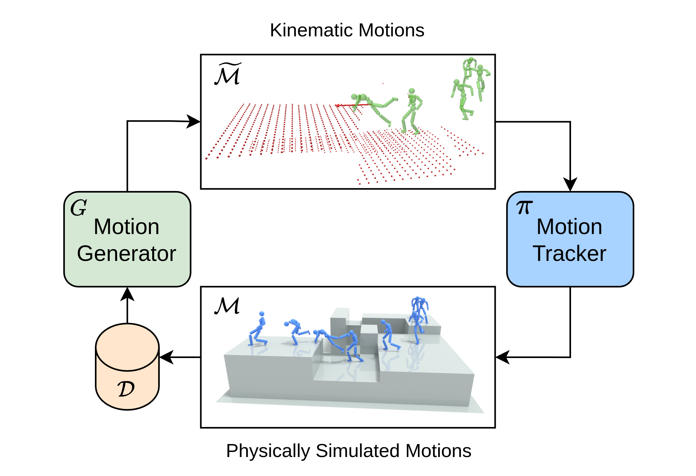

PARC 每一轮大致如下:

```text
Input: 当前数据集 D_{i-1}

1. 继续训练 motion generator G_i
   条件: terrain heightmap h, target direction/path d, previous frames
   输出: kinematic motion sequence

2. 用 G_i 在新地形上生成 synthetic motions \tilde{M}_i
   通过 batch selection 和 kinematic optimization 先做一层启发式清理

3. 用 D_{i-1} ∪ \tilde{M}_i 训练 physics tracker π_i
   tracker 在 Isaac Gym 中学习追踪这些参考动作

4. 用 π_i 追踪 \tilde{M}_i, 记录成功执行的 simulated motions M_i
   追踪失败的片段不进入新数据集

5. 更新数据集 D_i = D_{i-1} ∪ M_i
```

两个模型是 continual training: 第 $i$ 轮的 generator 和 tracker 都从上一轮模型初始化, 不是每轮从零训练。这个设计让迭代扩增更像 curriculum, 每轮都在上一轮的动作分布上往外推一点。

## Motion Generator

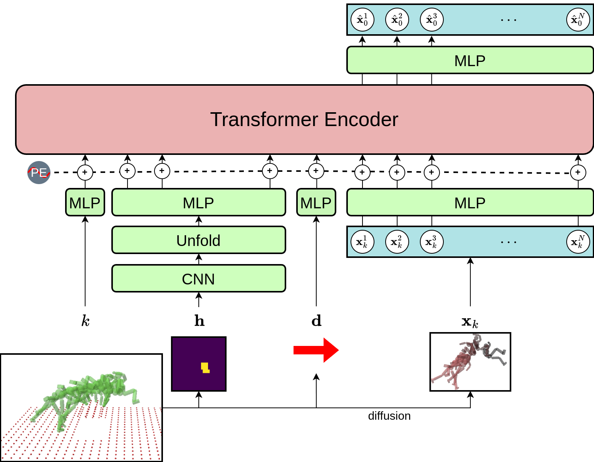

生成器是一个 MDM 风格的 diffusion model, 用 Transformer encoder 做去噪模型。它的任务是: 给定局部地形和目标方向, 生成一段用于穿越地形的 kinematic motion sequence。

每一帧 motion feature 包含:

- root position $p_0$
- root rotation $q_0$
- joint rotations $q$
- joint positions $p$
- contact labels $c$

所有旋转用 exponential map 表示。条件输入包括:

- 局部 heightmap $h$: $31 \times 31$ 采样网格, 角色局部坐标系下表示。
- 目标方向 $d$: 水平 2D direction。
- 前两帧 motion: 可选条件, 让模型知道速度和当前运动趋势。

训练采样时, 论文从 motion clip 中取半秒窗口, 切成 13 个 future frames 和 2 个 past frames。每帧都相对第二帧 canonicalize, 第二帧被视为“当前最近帧”。这让模型可以自回归生成长时动作: 生成一小段, 再拿输出帧作为下一段的 previous frames。

### Diffusion 训练目标

生成器预测 clean motion sample $x_0$, 而不是预测 noise。基础 reconstruction loss 之外, 作者额外加了几个几何/物理相关 loss:

$$
L(G) = L_{\mathrm{rec}} + L_{\mathrm{velocity}} + L_{\mathrm{joint}} + L_{\mathrm{pen}}
$$

- $L_{\mathrm{rec}}$: 位置、旋转、contact label 的重建误差。
- $L_{\mathrm{velocity}}$: 位置速度和角速度误差, 约束时间连续性。
- $L_{\mathrm{joint}}$: 预测 joint positions 和 forward kinematics 计算结果的一致性。
- $L_{\mathrm{pen}}$: terrain penetration loss, 惩罚身体表面点穿进 2.5D 地形。

这里值得注意: generator 本身仍是 kinematic generator, 不是物理仿真器。$L_{\mathrm{pen}}$ 和 contact 相关启发式只是让它更少犯低级地形错误, 真正的物理可执行性仍要靠 tracker 在 simulation 里验证。

### Terrain-aware generation

论文认为小数据训练出来的 autoregressive generator 容易过度依赖 previous frames, 因而忽略 terrain condition。例如, 前几帧在跑, 模型就继续跑, 即使前面是一堵墙。

PARC 用了两招缓解:

- 训练时加入 terrain penetration loss。
- 训练时有 10% 概率让 generator 在随机地形上生成 motion, 此时关闭 reconstruction loss, 并用 terrain penetration loss 给生成结果施加“不要穿地形”的几何约束。

还有一个很有意思的 blended denoising:

$$
\begin{aligned}
G_{\mathrm{blend}}
&= s\,G(k, x_k, C=(h, d)) \\
&\quad + (1 - s)\,G(k, x_k, C=(h, d, x_1, x_2))
\end{aligned}
$$

直观理解:

- $G(h, d, x_1, x_2)$: 更依赖前两帧, 动作更平滑, 但容易忽略地形。
- $G(h, d)$: 更依赖地形和方向, 地形合规性更好, 但时间连续性可能变差。
- $s$: 在“地形合规”和“时间平滑”之间做权衡。

实验里自动数据扩增使用 $s = 0.65$; 长时复杂地形 demo 使用 $s = 0.5$。

## Generator 深挖: 作者到底怎么把它用好

我现在觉得 PARC 的 generator 可以被概括成一句话: **它不是物理控制器, 而是一个被地形、方向和过去帧约束的短时 kinematic trajectory prior; 作者用一组几何损失、条件 dropout、候选筛选、运动学优化和物理回灌来防止这个 prior 在小数据自扩增时崩掉。**

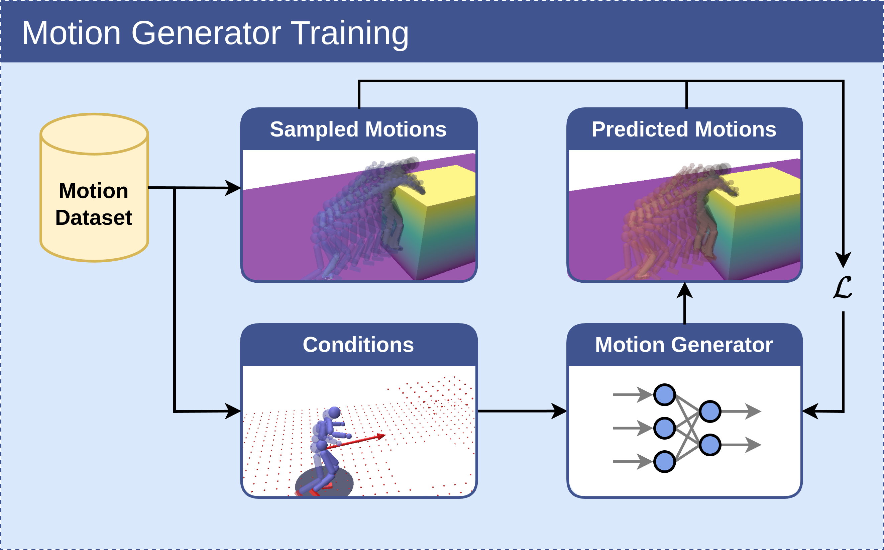

### 1. 生成器的任务定义

生成器学习的是条件分布:

$$
P(\text{motion sequence }x \mid \text{local heightmap }h,\ \text{target direction }d,\ \text{previous frames }x_1,x_2)
$$

它输出的是一段 kinematic motion sequence, 不是 torque、PD target、contact force 或 RL action。也就是说, 它的角色更像 planner/reference generator:

- 高层地形和路径告诉它“往哪里走”。
- 前两帧告诉它“现在以什么姿态和速度在动”。
- diffusion prior 告诉它“像人一样穿越地形的局部动作应该长什么样”。
- 后续 tracker 再判断这段 kinematic reference 是否能在物理仿真里执行。

这也是 PARC 能工作的第一个关键: generator 不承担所有职责。它只负责提出候选动作, 物理约束由后面的 tracker 和数据回灌逐步收紧。

### 2. 输出表示为什么这么设计

每帧 $x_i$ 同时包含 root、joint 和 contact:

$$
x_i = \{p_0,\ q_0,\ q,\ p,\ c\}
$$

这里有两个细节很重要:

1. **同时预测 joint rotations 和 joint positions。**  
   rotations 是骨架运动的自然控制变量, positions 直接反映身体在空间里的几何关系。二者同时预测会带来不一致风险, 所以后面用 $L_{\mathrm{joint}}$ 通过 forward kinematics 把它们拉回一致。

2. **contact labels 是 motion feature 的一部分。**  
   这不是可有可无的附加标签。parkour 的核心是手脚和地形接触: 抓边、撑墙、落地、爬上平台。没有 contact, generator 即使姿态看起来对, 也可能学出漂浮或滑动。

### 3. 训练样本怎么构造

训练时从 motion clip 里均匀采样半秒 motion sequence, 切成:

```text
2 past frames + 13 future frames
```

每个 sequence 都相对第二帧 canonicalize。第二帧被视为当前条件帧, 因此:

- root 坐标不会因为全局位置变化而让模型浪费容量。
- 模型主要学习“从当前局部状态出发, 接下来半秒怎么和地形互动”。
- 前两帧提供速度信息, 比只给一帧更容易保持动作连续。

target direction 的构造也很实用: 从 future frames 里随机选一帧决定目标方向。这样模型不是只学固定 horizon 的终点, 而是在同一段 motion 中看到不同时间尺度的方向条件。

局部 heightmap $h$ 来自 motion 对应的全局地形, 用 $31 \times 31$ uniform grid 在第二帧局部坐标系下采样。论文的地形是 2.5D heightfield, 每个 grid cell 是一个向下延伸的 box。

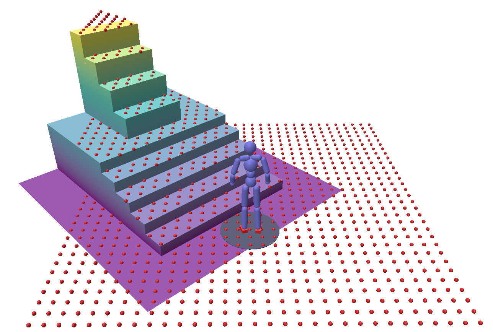

为了让 generator 不只记住训练地形, 作者还会给 heightmap 加随机旋转 box 做增强, 并用 collision-avoidance / non-interfering condition 避免增强地形直接穿进已有 motion。这里的策略很克制: 增强地形, 但不破坏原动作本身。

### 4. 网络结构: 把所有条件都 token 化

生成器是 Transformer encoder, 但它不是简单把 motion 序列扔进去。输入 token 分几类:

- diffusion timestep $k$: 用 embedding 编成 token。
- heightmap $h$: 先 CNN 得到 $64 \times 16 \times 16$, 再 unfold 成 64 个 $64 \times 2 \times 2$ image patches, 每个 patch 经 MLP 成 token。
- target direction $d$: MLP 成一个 token。
- noisy motion frames $x_k$: 每一帧经 MLP 成 token。
- previous frames $x_1, x_2$: 如果启用条件, 它们会替换输出序列中的前两帧 noisy tokens。
- positional encoding: 加到所有 token 上。

最后 Transformer 输出 token sequence, 再通过 MLP 映射成 clean motion prediction:

$$
G(k, x_k, C) = \hat{x}_0
$$

这点非常关键: PARC 的 diffusion model 预测的是 **clean sample $x_0$**, 不是 noise。后面的 DDIM sampling 也因此用了 modified update。

### 5. 训练目标: 不只是 reconstruction

基础 DDPM 目标是让模型从 noisy motion $x_k$ 和条件 $C$ 预测 clean motion $x_0$。但如果只做重建, 小数据下的 generator 很容易产生几何和物理 artifact。所以 PARC 的训练 loss 是:

$$
L(G) = L_{\mathrm{rec}}(G) + L_{\mathrm{velocity}}(G) + L_{\mathrm{joint}}(G) + L_{\mathrm{pen}}(G)
$$

#### $L_{\mathrm{rec}}$: clean motion 重建

旋转不能直接做普通欧氏差, 所以作者把 reconstruction 拆成 position、rotation、contact 三部分:

$$
\begin{aligned}
L_{\mathrm{rec}}
&= \|p_0 - \hat{p}_0\|^2 \\
&\quad + \|q_0 \ominus \hat{q}_0\|^2 \\
&\quad + \|c_0 - \hat{c}_0\|^2
\end{aligned}
$$

其中 $\ominus$ 表示旋转差。这个 loss 保证基本动作内容、姿态和 contact label 贴近数据。

#### $L_{\mathrm{velocity}}$: 时间连续性

$$
\begin{aligned}
L_{\mathrm{velocity}}
&= \|\dot{p}_0 - \dot{\hat{p}}_0\|^2 \\
&\quad + \|\dot{q}_0 - \dot{\hat{q}}_0\|^2
\end{aligned}
$$

位置速度用 finite difference; 角速度先做 quaternion finite difference, 再转 exponential map。这个项负责减少 temporal jitter, 让生成动作不要逐帧抖。

#### $L_{\mathrm{joint}}$: 表示一致性

$$
L_{\mathrm{joint}} = \|\hat{p}_0 - FK(\hat{x}_0)\|^2
$$

因为模型同时预测 joint positions 和 joint rotations, 它可能预测出“位置上像对了, 但骨架旋转推出的位置不一致”的结果。$L_{\mathrm{joint}}$ 用 forward kinematics 约束二者一致, 等于给网络补了一层骨架几何先验。

#### $L_{\mathrm{pen}}$: 地形穿透惩罚

论文把 2.5D terrain 近似成 signed distance field, 在角色身体表面采样点 $p_i$, 对穿入地形的点加惩罚:

$$
L_{\mathrm{pen}} = \sum_i -\min(sd_{\mathrm{Terrain}}(p_i), 0)
$$

这项不是让动作完全物理正确, 但能显著减少“身体直接穿墙/穿地”的失败样本。对 PARC 来说, 这是 generator 能进入后续 tracker 阶段的最低门槛。

### 6. 额外的 terrain-only 训练: 解决 OOD 地形

作者观察到: 小数据 generator 在自回归时会过度依赖 previous frames。比如前两帧像在跑, 它就继续跑, 即使前面是墙。这是 terrain-conditioned generation 的核心失败模式。

所以训练时有一个额外技巧:

```text
10% probability:
  在随机地形上让 generator 合成 motion
  关闭 reconstruction loss
  用 terrain penetration loss 约束穿模
```

这个技巧的意义是: 即使没有 ground-truth motion, 也能告诉 generator “至少不要穿地形”。它暂时放下动作语义重建, 换来对 OOD heightmap 的几何约束。

### 7. Blended denoising: 这篇里最有意思的 generator insight

作者认为 terrain penetration 的根源之一是 previous-frame overfitting。于是他们借鉴 classifier-free guidance 的思想, 同时训练两个条件版本:

$$
\begin{aligned}
\text{conditional:}\quad &G(k, x_k, C=(h, d, x_1, x_2)) \\
\text{unconditional:}\quad &G(k, x_k, C=(h, d))
\end{aligned}
$$

这里的 “unconditional” 不是完全无条件, 而是**不看 previous frames**, 仍然看 terrain 和 target direction。训练时用 15% 概率 mask 掉前两帧 token 的 attention, 让同一个模型学会这两种模式。

推理时做线性混合:

$$
\begin{aligned}
G_{\mathrm{blend}}
&= s\,G(k, x_k, C=(h, d)) \\
&\quad + (1 - s)\,G(k, x_k, C=(h, d, x_1, x_2))
\end{aligned}
$$

我的理解:

- 看 previous frames 的模型更会保持连续性, 但容易“惯性太强”, 忽略地形。
- 不看 previous frames 的模型更关注地形和方向, 更容易避开墙和平台, 但动作会变抖。
- $s$ 控制把采样推向“地形合规”还是“时间平滑”。

Table 3 正好印证这个 tradeoff:

| s | 地形合规 | 时间连续性 | 现象 |
| ---: | --- | --- | --- |
| 0 | 很差 | 最平滑 | TPL/TCL 爆炸, 但 %HJF 很低 |
| 0.5 | 中等 | 很平滑 | 适合长 horizon demo, 但仍有较多穿透 |
| 0.65 | 好 | 可接受 | 自动数据扩增使用的折中点 |
| 1 | 最好 | 很差 | TPL/TCL 最低, 但 high jerk frames 极高 |

这也是作者“用好 generator”的关键取舍: **宁愿让动作有一点 smoothness artifact, 也不能让它严重违反 terrain constraint。** 因为轻微 jitter 后面可以被 kinematic optimization 和 physics tracker 修, 但跑进墙里的 reference motion tracker 根本追不了。

### 8. Sampling: 为什么还要候选筛选和优化

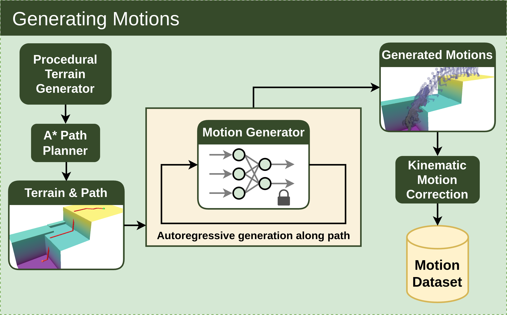

生成新数据时, pipeline 是:

```text
procedural terrain
  -> A* path planner
  -> autoregressive diffusion generation along path
  -> batch selection
  -> kinematic motion optimization
  -> motion dataset / tracker training
```

generator 沿路径自回归生成长动作。每 0.5 秒 motion 的生成不是一次只采一条, 而是并行生成一个 batch:

- 自动数据扩增时, batch size 是 64。
- 长 horizon demo 中, batch size 是 32。
- 评估中使用 DDIM stride 5。

然后用启发式选择最好的候选:

$$
L_{\mathrm{motion}} = L_{\mathrm{pen}} + L_{\mathrm{contact}} + \text{path incompletion penalty}
$$

这个 selection 很重要。它承认 diffusion sample 有随机性和坏样本, 但不强迫单次采样完美, 而是用多候选 + 几何启发式在采样层做 first-pass filtering。

选中后再做 kinematic optimization:

$$
\begin{aligned}
L &= w_{\mathrm{reg}}L_{\mathrm{reg}} \\
&\quad + w_{\mathrm{pen}}L_{\mathrm{pen}} \\
&\quad + w_{\mathrm{contact}}L_{\mathrm{contact}} \\
&\quad + w_{\mathrm{jerk}}L_{\mathrm{jerk}}
\end{aligned}
$$

它修四类问题:

- $L_{\mathrm{reg}}$: 不要偏离原始生成 motion 太多。
- $L_{\mathrm{pen}}$: 减少身体穿地形。
- $L_{\mathrm{contact}}$: contact label 说该接触时, 身体表面点要贴近地形。
- $L_{\mathrm{jerk}}$: 减少关节 jerk, 去掉很硬的抖动。

这说明 PARC 并不迷信 generator raw output。作者真正使用 generator 的方式是: **先让它提出多个可能轨迹, 再用可解释的几何目标筛掉坏轨迹、修好中等轨迹, 最后才交给 tracker。**

### 9. Generator 的数据闭环价值

从单轮看, generator 只是 motion synthesis model。从多轮看, 它有更重要的作用: **制造 tracker 和下一轮 generator 都需要的新训练分布。**

关键闭环是:

```text
G_i 生成更难、更长、更多样的 terrain traversal reference
π_i 在物理仿真中追踪这些 reference
成功追踪的 motion M_i 进入 D_i
G_{i+1} 在更物理、更丰富的数据上继续训练
```

这也是为什么 Table 1 里 `no physics correction` 很重要。没有 physics tracker 回灌, generator 会学到一些运动学 shortcut, 例如空中突然改变轨迹。加入 physics correction 后, 下一轮 generator 看到的是“在仿真里真实执行过”的 motion, 这会把生成分布慢慢往可执行动作上推。

### 10. 我认为这篇论文的 generator insight

PARC 不是提出了一个全新的 diffusion architecture, 而是提出了一套**把 motion diffusion 用在稀缺 parkour 数据扩增上的可靠工程 recipe**:

1. **局部 canonicalization 降低学习难度。**  
   模型不需要记全局位置, 只学当前局部身体状态、局部地形和未来短时动作之间的关系。

2. **contact labels 进入生成表示。**  
   对地形交互动作来说, contact 是动作语义的一部分, 不是 tracker 阶段才补的东西。

3. **loss 里显式注入几何约束。**  
   $L_{\mathrm{velocity}}$ 管时间连续, $L_{\mathrm{joint}}$ 管骨架一致, $L_{\mathrm{pen}}$ 管地形穿透。每个 loss 都对应 generator raw output 的一种常见坏模式。

4. **用 conditional dropout/blended denoising 调控“惯性”和“地形服从”。**  
   这是最像 insight 的地方: previous frames 对连续性有益, 对 terrain compliance 有害。作者没有二选一, 而是训练时 mask、推理时 blend。

5. **采样后不直接相信模型。**  
   batch selection 和 kinematic optimization 让 generator 可以保持多样性, 同时把明显不适合 tracker 的样本挡在外面。

6. **物理回灌把 generator 从 kinematic prior 推向 executable prior。**  
   真正让迭代变强的不是 diffusion 自训练本身, 而是每轮都用 tracker 把数据投影到 physics-feasible subset。

### 11. 这套方法的边界

generator 仍然有几个明显限制:

- 它生成慢: 论文报告 A6000 上生成 0.5 秒 motion 大约要 12 秒, 不能实时闭环。
- 它只看 2.5D heightmap, 不是任意 3D scene。
- 它依赖初始动作和地形配对数据, 还依赖 contact labels。
- 它不能独立保证动力学可执行, 必须靠 tracker 过滤。
- 它的“物理性”主要来自几何 loss + 后处理 + tracker 回灌, 不是 diffusion 模型内部真正理解 dynamics。

## Kinematic Motion Correction

在把 generator 产出的 motion 交给 tracker 前, PARC 还做了一层 kinematic correction。原因很实际: 如果 reference motion 太离谱, tracker 甚至没法开始追。

生成新动作时会批量采样多个候选, 再用启发式选择最好的:

$$
L_{\mathrm{motion}} = L_{\mathrm{pen}} + L_{\mathrm{contact}} + \text{path incompletion penalty}
$$

选中候选后, 再优化整段 kinematic motion:

$$
\begin{aligned}
L &= w_{\mathrm{reg}}L_{\mathrm{reg}} \\
&\quad + w_{\mathrm{pen}}L_{\mathrm{pen}} \\
&\quad + w_{\mathrm{contact}}L_{\mathrm{contact}} \\
&\quad + w_{\mathrm{jerk}}L_{\mathrm{jerk}}
\end{aligned}
$$

论文给出的权重是 $w_{\mathrm{reg}} = 1$, $w_{\mathrm{pen}} = 1000$, $w_{\mathrm{contact}} = 1000$, $w_{\mathrm{jerk}} = 1000$, Adam 优化 3000 步。这里的 correction 不是物理仿真, 更像给 kinematic trajectory 做一个“不要穿地形、不要缺 contact、不要太抖”的预清理。

## Physics Tracker

tracker 采用 DeepMimic 风格的强化学习 motion tracking controller, 在 Isaac Gym 里训练。policy 以 30 Hz 输出各关节 PD controller 的 target orientation, 物理仿真以 120 Hz 运行。

observation 包含三类信息:

- proprioceptive state: root pose, joint rotations, joint positions, contact labels 等。
- local terrain observations: 角色周围采样的 heightmap。
- future target frames: 来自 reference motion 的未来帧。

reward 由多个 tracking 项组成:

- root position / root velocity
- joint rotation / joint velocity
- hands and feet 等 key body positions
- contact label reward

我觉得 contact label reward 是这里很关键的一个工程点。parkour 不是只有姿态像不像, 更重要的是什么时候手/脚/身体部位该接触墙、地面或平台。如果 contact 错了, 即使骨架位置误差不大, 动作也会变成漂浮、滑动或不自然支撑。

## Physics-based Motion Correction

每轮 tracker 训练好后, PARC 会让它在 simulation 中追踪 generator 产出的 kinematic motions。只有成功追踪到末帧的轨迹才会被记录为 physics-corrected motions, 加入下一轮数据集。

如果某些 reference motion 的早期帧太难追, 论文还会从 motion 的不同时间点初始化角色, 然后记录“最早能够成功跑到末帧”的那段。这是一个很实用的 salvage 技巧: 不强求整段都可追, 先把可执行的后半段动作救回来, 给下一轮 generator 用。

## 数据和实验设置

初始数据集包含 14 分 7 秒 motion data, 覆盖 climbing、vaulting、running on flat/bumpy ground、上下平台、上下楼梯等技能。其中还有 5.5 秒来自 Unreal Engine Game Animation Sample Project。对应 terrain 是手工重建以匹配 motion, contact labels 也是手工标注。

因为初始数据空间多样性太低, 作者先做了一轮非生成式的空间扩增: 对每个原始 motion clip 生成 50 个地形变化, 用手工启发式调整 motion, 再用 physics tracker 记录更物理合理的版本。论文特别说明, 这一步不靠 motion generator 发现新技能, 只是为了改善 PARC 初始迭代的数据覆盖。

正式 PARC 训练使用单张 A6000, 总计约一个月。论文表格使用 Iteration 1 到 4 的编号; 正文里对“三轮/四轮”的说法有一点不一致, 我在笔记里按表格的 Iteration 1-4 来理解。

## 实验结果怎么看

### 1. Generator 随迭代变好

Table 1 用 100 个新测试地形, 每个地形生成 32 条 motion, 共 3200 条来评估 generator。指标包括:

- $FWD$: final waypoint distance, 越低说明越接近目标路径终点。
- $TPL$: terrain penetration loss, 越低说明越少穿地形。
- $TCL$: terrain contact loss, 越低说明 contact 更合理。
- $\%HJF$: high jerk frames 百分比, 越低说明动作更平滑。

| Generator | FWD ↓ | TPL ↓ | TCL ↓ | %HJF ↓ |
| --- | ---: | ---: | ---: | ---: |
| Iteration 1 | 1.908 | 2093 | 114.1 | 10.70 |
| Iteration 2 | 1.586 | 705.5 | 9.761 | 4.387 |
| Iteration 3 | 0.747 | 448.2 | 8.070 | 3.238 |
| Iteration 4 | 0.596 | 179.6 | 9.763 | 2.730 |
| no physics correction | 1.572 | 547.3 | 17.44 | 18.68 |

最重要的对照是 `no physics correction`: 没有 tracker 回灌的生成数据会显著增加 high jerk frames, 说明生成模型在自吃数据时很容易学到“运动学上能过、物理上离谱”的轨迹, 例如空中突然改方向。physics correction 没有让每个指标都单调完美, 但明显控制了物理不合理动作的积累。

### 2. Tracker 也随迭代变强

Table 2 评估每轮 tracker 追踪对应 generator 生成动作的成功率:

| Tracker | Success Rate ↑ | Joint Tracking Error ↓ |
| --- | ---: | ---: |
| Iteration 1 | 27% | 0.08294 |
| Iteration 2 | 44% | 0.05851 |
| Iteration 3 | 60% | 0.05321 |
| Iteration 4 | 68% | 0.05167 |

这个结果说明数据扩增不是只喂给 generator。tracker 自己也在不断看到更复杂的 synthetic reference, 学会更多接触丰富、跨地形的动作。

### 3. Blended denoising 是一个 tradeoff

Table 3 很好地说明了 $s$ 的作用:

| s | FWD ↓ | TPL ↓ | TCL ↓ | %HJF ↓ |
| ---: | ---: | ---: | ---: | ---: |
| 0 | 0.908 | 40796 | 185.3 | 1.479 |
| 0.25 | 0.776 | 7411 | 44.93 | 1.113 |
| 0.5 | 0.571 | 4872 | 32.58 | 1.017 |
| 0.65 | 0.596 | 179.6 | 9.763 | 2.730 |
| 0.75 | 0.574 | 132.2 | 7.718 | 8.434 |
| 1 | 0.537 | 129.8 | 6.751 | 54.82 |

$s$ 越低, 模型越依赖 previous frames, 时间上更平滑, 但地形错误很严重。$s$ 越高, terrain compliance 更好, 但动作容易抖。$s = 0.65$ 是自动扩增时选的折中点。

### 4. 定性效果: 迭代和物理纠错真的有差

Fig. 7 展示了最终系统产生的新组合技能, 比如跳过 gap 后抓住 ledge、从平台下落时用手抓住另一个 ledge 等。这些动作不是单个原始技能的简单复制, 更像是把 jumping、climbing、dropping、landing 等局部技能重新组合。

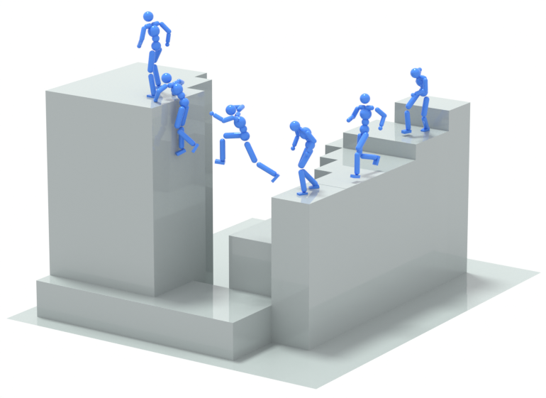

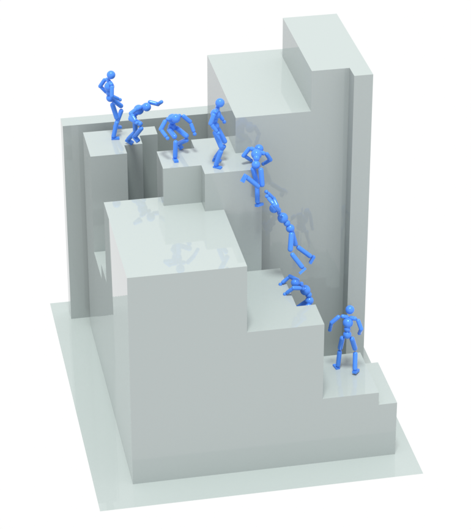

Fig. 8 的对比更能说明 physics correction 的作用:

| Iteration 1 | no physics correction | final generator |
| --- | --- | --- |
| 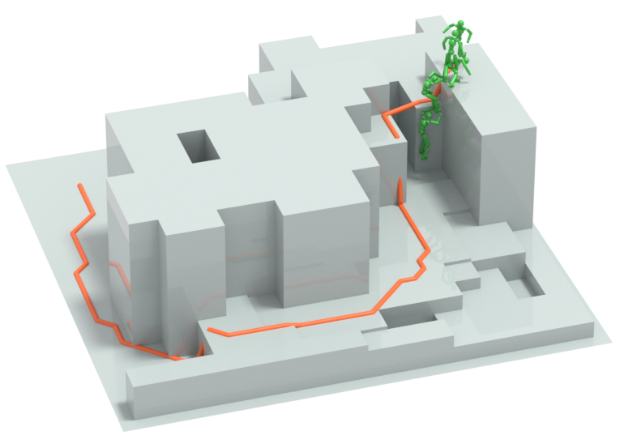 | 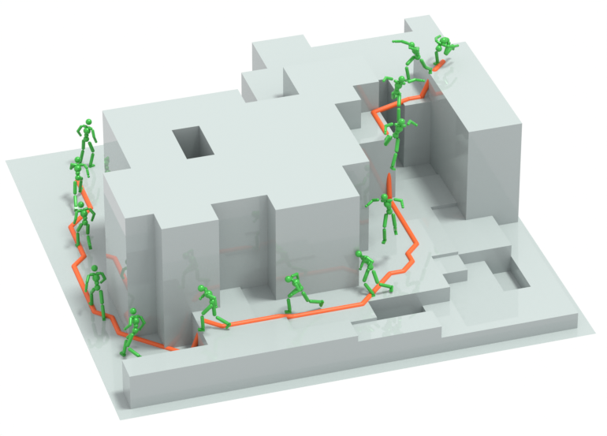 | 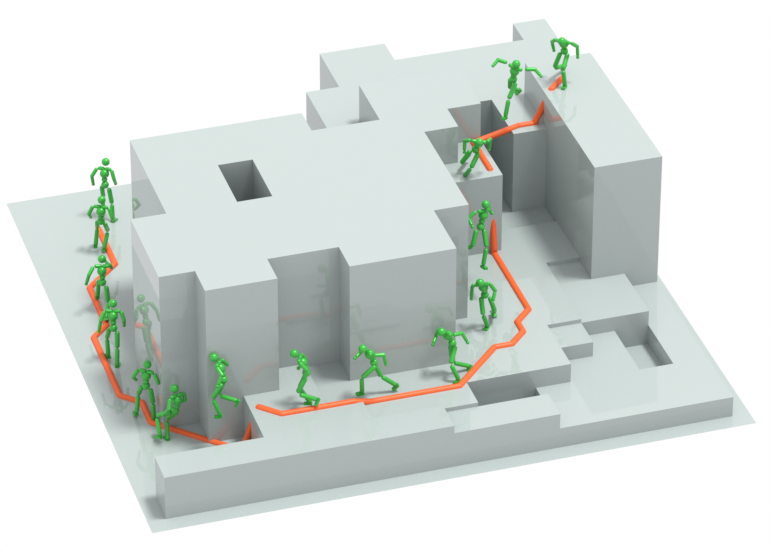 |

我的理解是: PARC 不是让 generator 一次学会物理, 而是每一轮都让 tracker 把生成分布里“能在物理世界落地的那部分”筛出来, 再让下一轮 generator 往这部分数据上靠。

## 我觉得最值得记住的点

1. **这是一个 self-consuming loop, 但有 self-correction。**  
   单纯让生成模型吃自己的输出会积累 artifacts; PARC 把 physics tracker 放进循环, 让回灌数据来自 simulation 中真实执行过的动作。

2. **diffusion 不是唯一重点。**  
   附录里作者明确说, motion generator 用 diffusion 是他们的实现选择, 但 PARC 的通用 recipe 更重要: sample motion+terrain, condition on past frames and terrain, predict future frames, then physics-correct successful samples.

3. **generator 和 tracker 互相扩能力。**  
   generator 负责探索更多地形/路径上的候选动作; tracker 负责把候选动作投到物理可执行集合附近。下一轮两者都从更大的数据分布中继续训练。

4. **contact 是 parkour 的灵魂。**  
   论文里 contact labels 出现在 generator features、terrain contact loss、tracker reward 中。对于爬墙、抓 ledge、落地这种动作, contact 合理性比普通 locomotion 更重要。

5. **它更像离线数据生成框架, 不是实时控制系统。**  
   论文给出的生成速度是 A6000 上每 0.5 秒 motion 约 12 秒, 最后讨论也承认 generator 还不够实时闭环规划。这一点对游戏或机器人部署很关键。

## 局限和疑问

- **实时性不足。** 生成器目前明显不能实时闭环 planning, 所以 PARC 更适合作为离线数据扩增和 controller 训练框架。
- **terrain 是 2.5D heightmap。** 这简化了复杂几何, 对真实世界、室内杂乱场景、非高度场结构的适应性还不清楚。
- **仍依赖初始高质量数据和人工处理。** 初始 MoCap、手工 terrain reconstruction、手工 contact labels、初始空间扩增都很重要, 不是完全从零自动发现 parkour。
- **physics correction 不是物理最优性保证。** tracker 成功追踪说明动作可执行, 但不保证动作最自然、最省力或符合人类偏好。论文也承认仍可能产生 unnatural behaviors。
- **指标主要是启发式。** FWD/TPL/TCL/%HJF 能捕捉很多 artifacts, 但不能完整代表动作审美、策略多样性或人类可解释性。
- **iteration 编号有点混乱。** 正文和图表对 iteration 数量的表述不完全一致, 复读实验时最好直接看代码和 release 数据。

## 和其他方向的连接

PARC 和很多“生成模型 + 物理控制”的工作目标相近, 但它的落点很清楚:

- 和纯 kinematic motion diffusion 相比: PARC 用 simulation 过滤/修正生成数据, 减少自吃数据导致的物理 artifacts。
- 和纯 RL parkour controller 相比: PARC 保留 MoCap/生成模型中的人形动作先验, 不完全靠 reward 自己探索。
- 和 online generative controller 相比: PARC 把重计算的 diffusion 放到数据扩增阶段, 最终 tracker 可以作为常规控制器运行。

如果把它抽象成一句话: **PARC 用生成模型扩大“想象中的动作空间”, 用物理 tracker 把想象筛成“仿真中真的发生过的动作数据”。**

## 后续想深挖的问题

- `no physics correction` 的数据是如何筛选的? 只用了 selection heuristic, 但没有 kinematic optimization 还是没有 tracker correction? 需要结合代码确认。
- tracker 记录成功 motion 时, 对失败前半段的 salvage 会不会让数据分布偏向“中后段动作”, 从而影响 generator 学习完整动作?
- contact labels 的来源在后续 synthetic 数据中由 simulator 自动标, 这会不会把 tracker 的 contact 偏差反过来写进 generator?
- 如果把 diffusion generator 换成 autoregressive transformer 或 flow matching, PARC loop 是否仍然稳定?
- 对机器人而言, 这个框架的最大缺口是 sim-to-real、感知和实时规划, 哪个最先卡住?
